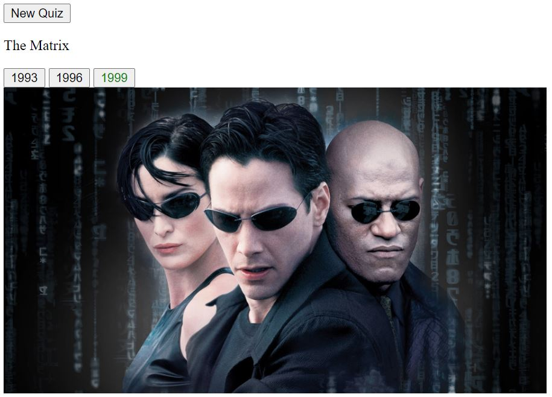

# Rest-Service

REST Service built on top of themoviedb.org api:

https://www.themoviedb.org/documentation/api

# Status

[](https://app.circleci.com/pipelines/github/owalshe)


# Sample Output

GET movie-quiz/create-year-of-release

```json
{
	"imagePath":"http://image.tmdb.org/t/p/original/lpn1whaulslRtxxufxX9lhEQ0Bn.jpg",
	"id":37799,
	"name":"The Social Network",
	"choices":[2007,2010,2013]
}
```

GET movie-quiz/answer-year-of-release?movieId=37799&year=2010

```json
{
  "isCorrect":true
}
```

# Sample Rendering:



